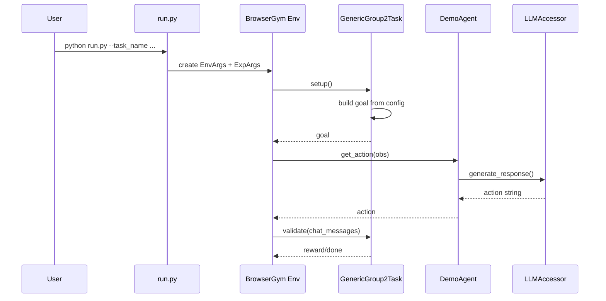

# Sample Script for ICPR 2026 paper

- Adds action space
  - analyze_image
  - analyze_video
- Supports multiple LLMs
  - ChatGPT
  - Gemini

## Setup

Rename `.env.sample` to `.env` and edit the contents.

```
# OpenAI (ChatGPT)
OPENAI_API_KEY=xxxxxx
OPENAI_BASE_URL=https://api.openai.com/v1/
OPENAI_MODEL=gpt-4o

# Google Gemini
GEMINI_API_KEY=xxxxx
GEMINI_BASE_URL=https://generativelanguage.googleapis.com/v1beta
GEMINI_MODEL=gemini-2.5-flash
```

## Run

Example: run task `2.3.0011` with `GPT-4o`.

```
python3 demo_fwa_icpr2026/run.py --task_name fieldworkarena.2.3.0011 --result_dir results --model_name gpt-4o
```

### model_name

gpt** : Using OpenAI API with model
gemini** : Using Gemini API with model
claued** : Using Claude API with model
llama** : Using Llama(ollama) API with model

## Notes

- API limits may cause errors.
  - ChatGPT does not accept more than 100 image inputs.
  - Gemini has a 10 MB request limit, so it cannot accept large batches of images.

## Main Run Flow

